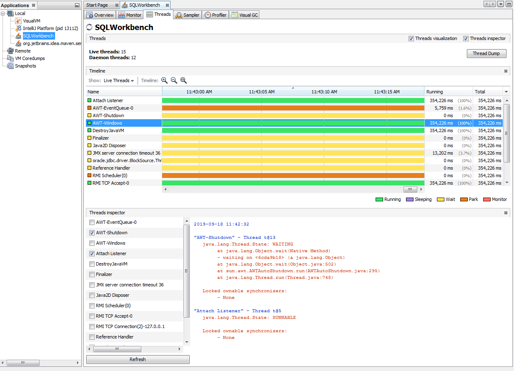

= Java JVM
:sectnums:
:toc:
:toclevels: 4
:toc-title: Table of Contents

== Understanding Java Garbage Collection
https://www.cubrid.org/blog/understanding-java-garbage-collection[Understanding Java Garbage Collection]

`There is a term that you should know before learning about GC. The term is #"stop-the-world."# Stop-the-world will occur no matter which GC algorithm you choose. Stop-the-world means that the JVM is stopping the application from running to execute a GC. When stop-the-world occurs, every thread except for the threads needed for the GC will stop their tasks. The interrupted tasks will resume only after the GC task has completed. GC tuning often means reducing this stop-the-world time.`

`Java does not explicitly specify a memory and remove it in the program code. Some people sets the relevant object to null or use System.gc() method to remove the memory explicitly. Setting it to null is not a big deal, but calling System.gc() method will affect the system performance drastically, and must not be carried out. (Thankfully, I have not yet seen any developer in NHN calling this method.)`

[NOTE]
.Two hypotheses - #Weak Generational Hypothesis#
====
. Most objects soon become unreachable.
. References from old objects to young objects only exist in small numbers.
====

Young Generation::
* Holds newly created objects which soon become unreachable.
* #Minor GC# - when objects disapear from this area.

Old Generation::
* Holds objects, #copied here#, reachable and survived from young generation.
* Larger than young generation.
* GC occurs less frequently.
* #Major GC# when objects disappear from this area.

Permanent Generation::
* #Method area" which holds classes and interned character strings.
* Not survived from old generation. It is permanent.
* GC may occur in this area. It's also counted as #Major GC#.

.GC Area & Data Flow
image::images/HotSpotJVM_Generations.png[]

Card Table - 512-byte chunk::
Card table records it when an object in the old generation references an object in the young generation. When a GC is executed for the #young generation#, #only# this card table is searched to determine whether or not it is subject for GC instead of checking all the objects in #old generation#. This table is managed with #write barrier#, which allows a faster performance for #minor GC#.

.Card Table Structure
image::images/card_table.png[]

=== Composition of the Young Generation
The young generation is divided into three spaces:

. One #Eden# space
. Two #Survivor# spaces

== VisualJVM
. Monitors Java processes locally and remotely
. Overview shows JVM configurations and environments
. Monitors performance and memory
. Monitors threads
. Profile Java classes
. Profile JDBC SQL queries
. Take and browse snapshots, core dumps, thread, heap dumps, etc.
. Analyz core dumps, thread dumps
. OQL - Object Query Language can be used to explore objects, which can help identify abnormalities.
. Many plugins to expand the functionalities.
. Visual GC can shows Young / Eden and old generations visually. Run the application continuously and the changes in class loader time, GC time, Eden Space, Survivor 0 and 1 spaces, Old Gen and metaspace can be shown dynamically.
. Thread Inspector shows thread details, fields, references, and hierarchies.

.Visual GC

.Thread Inspector

.Thread Details

== JConsole
JConsole is included in JDK. It can be used to monitor Java applications including application servers like Weblogic.

== Intellij Profiler
It only supports Linux and MacOS.

