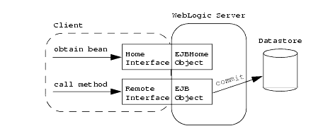

= EJB
:sectnums:
:toc:
:toclevels: 4
:toc-title: Table of Contents

== EJB
. Session Beans - Stateful, Stateless or Singleton.
. Message Driven Beans - support asynchrnonous execution via messaging.
. Look up for EJB through JNDI.
. Interfaces
.. Local interface : accessed within the same JVM. Annotation @Local on local interface.
.. Remote interface : accessed from remote JVM. Performance is slower than local interface. Annotation @Remote.
.. EJB Home interface :  create, find, and remove EJB objects.

NOTE: JNDI or Java Naming Directory Interface is a directory service which allows lookup of resources. Every resource like an EJB, a Datasource or a JMS Queue running on an application server is given a JNDI name which will be used to locate the resource.

.EJB Interfaces

EJB 2.1 vs EJB 3.+
.EJB 2.1 - Use XDocLet to generate interfaces and configurations
....
/**
 * @ejb.bean
 *    name="SamplesBean"
 *    jndi-name="ejb/Samples"
 *    view-type="remote"
 *    type="Stateless"
 *    transaction-type="Container"
 * @ejb.home
 *    extends="javax.ejb.EJBHome"
 *    remote-class="y.w.claim.SamplesHome"
 * @ejb.interface
 *    extends="javax.ejb.EJBObject, y.w.SampleInterface"
 *    remote-class="y.w.claim.Samples"
 * @ejb.env-entry
 *    name="DefaultDataSourceName"
 *    description="DataSource Name"
 *    type="java.lang.String"
 *    value="TDS"
 * @ejb.env-entry
 *    name="someValue"
 *    description="someValue"
 *    type="java.lang.String"
 *    value="${y.w.someValue}"
 * @ejb.resource-ref
 *    res-ref-name="DefaultDataSource"
 *    res-type="javax.sql.DataSource"
 *    res-auth="Container"
 *    jndi-name="${myDataSource}"
 * @weblogic.enable-call-by-reference True
 * @weblogic.clustering
 *    stateless-bean-is-clusterable="False"
 *    home-is-clusterable="False"
 */
public class SampleEJB implements LocalInterface, RemoteInterface
{
    private static final String someValue = "someValue";
}
....

.EJB 3.0
....
@Stateless
public class SampleEJB implements LocalInterface, RemoteInterface
{
    private static final String someValue = "someValue";
}

@Local
public interface LocalInterface {}

@Remote interface RemoteInterface {}
....

