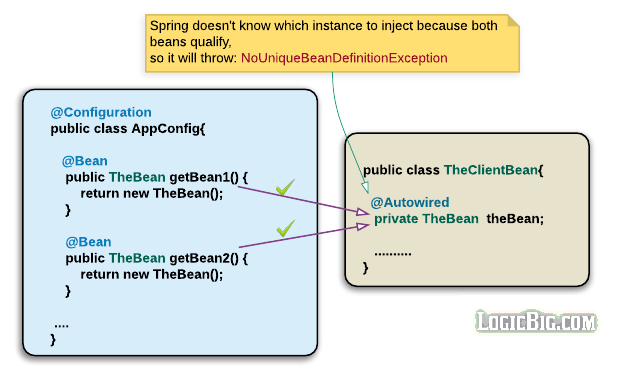

= Spring Framework Study Notes.
:sectnums:
:toc:
:toclevels: 4
:toc-title: Table of Contents

== Configuration Metadata
Configuration metadata instructing Spring IoC container how to instatiate, configure and assemble the objects.

Configuration metadata can be in the following format

. XML based
. Spring 2.5 - Annonation-based configurations. Examples include @Component, @Service, @Controller, etc.
. Spring 3.0 - Java based. This is especially useful if you want to define beans external to your application. Annonations include @Configuration, @Bean, @Import and @DependsOn.

Spring can use any of them or mix of the three configuration metadata.

== Instatiating a Container

There are a few ways to instatiate Spring ApplicationContext.

* Use ClassPathXmlApplicationContext. All paths are relative to the current JVM classpath.
....
ApplicationContext context = new ClassPathXmlApplicationContext("services.xml", "daos.xml");
....
* Use FileSystemXmlApplicationContext. All paths are relative to the current JVM working directory, even the path has leading slash "/". To specify absolute path, use "file:" prefix. But this is not recommended. Otherwise, it creates dependency on file system.
....
ApplicationContext context = new FileSystemXmlApplicationContext("config/services.xml")
....
* Use AnnotationConfigApplicationContext
....
ApplicationContext ctx = new AnnotationConfigApplicationContext();
		ctx.register(AppConfig.class);
		ctx.refresh();
....
* For Web Application, the DispatcherServlet will instantiate ApplicationContext automatically.

=== Instantiate Parent and Child Application Context
We can instantiate parent and child application context, with the parent context managing beans shared by all the application modules and child contexts are module specific.

....
ClassPathXmlApplicationContext parent = ClassPathXmlApplicationContext(...);
ClassPathXmlApplicationContext child1 = ClassPathXmlApplicationContext(...);
child1.setParent(parent);
ClassPathXmlApplicationContext child2 = ClassPathXmlApplicationContext(...);
child2.setParent(parent);

or

AnnotationConfigApplicationContext parentContext = new AnnotationConfigApplicationContext(ParentContext.class);

AnnotationConfigApplicationContext childContext = new AnnotationConfigApplicationContext();
childContext.setParent(parentContext);
childContext.register(ChildContext.class); //don't add in the constructor, otherwise the @Inject won't work
childContext.refresh();
....

==== Visibility of Beans
Beans hosted in child context are not visible from parent context. But beans hosted in parent context are visible to child context.

Test y.w.spring.context.SpringApplicationContextTest in project springtest demonstrates the visibility of beans in parent and child contexts.

=== Compose XML-based Configuration Metadata
XML based metadata can import the other XML file as below:

[source,xml]
----
<beans>
    <import resource="services.xml"/>
    <import resource="resources/messageSource.xml"/>
    <import resource="/resources/themeSource.xml"/>

    <bean id="bean1" class="..."/>
    <bean id="bean2" class="..."/>
</beans>
----

All location paths are relative to the definition file doing the importing, so services.xml must be in the same directory or classpath location as the file doing the importing, while messageSource.xml and themeSource.xml must be in a resources location below the location of the importing file. As you can see, a leading slash is ignored. However, given that these paths are relative, it is better form not to use the slash at all. The contents of the files being imported, including the top level <beans/> element, must be valid XML bean definitions, according to the Spring Schema.

=== Use Beans
The beans can be retrieved as below:

....
ClassA a = ctx.getBean("beanName", ClassA.class);
ClassA a = ctx.getBean(ClassA.class); // if only one instance
ClassA a = ctx.getBean("beanName");
....

Calling application context to get beans creates dependency on Spring framework. Indeed, your application code should have no calls to the getBean() method at all and thus have no dependency on Spring APIs at all.

== Beans
A bean is any Java object which is instantiated, initialized, and assembled by Spring IoC container. Also, any object created outside the container can be registered as a bean to be managed by the application context.

Beans that are singleton-scoped and set to be pre-instantiated (the default) are created when the container is created. Scopes are defined in Bean Scopes. Otherwise, the bean is created only when it is requested. Creation of a bean potentially causes a graph of beans to be created, as the bean’s dependencies and its dependencies' dependencies (and so on) are created and assigned.

Properties of a bean include

. Class - fully qualified Java class.
. Name - name of the bean which must be unique in the IoC container.
. Scope - Bean scope which can be singleton, prototype, session, request, etc.
. Constructor arguments.
. Properties.
. Lazy initialization mode.
. Initialization method.
. Destruction method.

Register an object created outside the container:
....
ClassA a = new ClassA(); // created outside the container.

BeanFactory beanFactory = ctx.getBeanFactory();
beanFactory.registerSingleton(a);
....

=== Naming Beans
Every bean has one or more identifiers. These identifiers must be unique within the container that hosts the bean. In a bean definition itself, you can supply more than one name for the bean, by using a combination of up to one name specified by the id attribute and any number of other names in the name attribute

. In XML-based configuration metadata, you can use id attribute, the name attribute or both to specify the bean identifiers.
. Id attribute specifies exactly one id.
. Name can have special characters.
. Name attribute can have multiple names, separated by comma or semicolon or white space.
. Id and name are not mandatory. In abscence of id and name, the container will generate a unique name for the bean.
. The convention is to use the standard Java convention for instance field names when naming beans. That is, bean names start with a lowercase letter and are camel-cased from there.

==== Aliasing a Bean
Aliases can be assigned to beans outside the bean definition. Specifying all aliases where the bean is actually defined is not always adequate, however. It is sometimes desirable to introduce an alias for a bean that is defined elsewhere.

....
<alias name="myApp-dataSource" alias="subsystemA-dataSource"/>
<alias name="myApp-dataSource" alias="subsystemB-dataSource"/>
....

=== Instantiating Beans
Bean can be instantiated in two ways:

. container calls the constructor reflectively to create an instance. This is equivalent to Java code with the new operator.
. container invokes a static factory method on a class to create the bean.

[source]
----
<bean name="bean1" class="y.w.Example"/>                                      // <1>
<bean id="bean2" class="y.w.ClientService"  factory-method="createInstance"/> // <2>

where

public class ClientService {
private static ClientService clientService = new ClientService();
    private ClientService() {}

    public static ClientService createInstance() {                          // <3>
        return clientService;
    }
}

<bean id="serviceLocator" class="examples.DefaultServiceLocator" />
<bean id="clientService" factory-bean="serviceLocator"
                         factory-method="createClientServiceInstance"/>     // <4>
----
<1> Instantiate bean with constructor.
<2> Instantiate bean by invoking the static factor method.
<3> Factory method.
<4> Calls a bean's factory method to instantiate a bean.

== Dependency Injection
Objects define dependencies through

. constructor arguments.
. arguments to factory method.
. properties that are set on the object after it is instantiated.

The container then injects the dependencies when it creates the bean. This is called Inversion of Control (IoC), or DI (Dependency Injection).

=== Constructor-based Dependency Injection
Constructor-based DI is accomplished by the container invoking a constructor with a number of arguments, each representing a dependency. Calling a static factory method with specific arguments to construct the bean is nearly equivalent, and this discussion treats arguments to a constructor and to a static factory method similarly.

==== Constructor Argument Resolution

* Matching the argument's type in the same order in which those arguments are supplied to the constructor.

....
<beans>
    <bean id="beanOne" class="x.y.ThingOne">
        <constructor-arg ref="beanTwo"/>                        <1>
        <constructor-arg ref="beanThree"/>
    </bean>
    <bean id="beanTwo" class="x.y.ThingTwo"/>
    <bean id="beanThree" class="x.y.ThingThree"/>

    <bean id="exampleBean" class="examples.ExampleBean">        <2>
        <constructor-arg type="int" value="7500000"/>
        <constructor-arg type="java.lang.String" value="42"/>
    </bean>
</beans>
....
<1> Matching argument types.
<2> For simple types, matching argument types by explicitly specifying types.

* Constructor Argument Index
....
<bean id="exampleBean" class="examples.ExampleBean">
    <constructor-arg index="0" value="7500000"/>
    <constructor-arg index="1" value="42"/>
</bean>
....

* Constructor Argument Name
....
<bean id="exampleBean" class="examples.ExampleBean">
    <constructor-arg name="years" value="7500000"/>
    <constructor-arg name="ultimateAnswer" value="42"/>
</bean>
....
Keep in mind that, to make this work out of the box, your code must be compiled with the debug flag enabled so that Spring can look up the parameter name from the constructor. If you cannot or do not want to compile your code with the debug flag, you can use the @ConstructorProperties JDK annotation to explicitly name your constructor arguments. The sample class would then have to look as follows:
....
public class ExampleBean {
    ...
    @ConstructorProperties({"years", "ultimateAnswer"})      <1>
    public ExampleBean(int years, String ultimateAnswer) {
        this.years = years;
        this.ultimateAnswer = ultimateAnswer;
    }
}
....
<1> Assign names to constructor arguments so that they can be used in the bean definition.

=== Setter-based Dependency Injection
Setter-based DI is accomplished by the container calling setter methods on your beans after invoking a no-argument constructor or a no-argument static factory method to instantiate your bean.

=== Constructor-based vs Setter-based

. it is a good rule of thumb to use constructors for mandatory dependencies and setter methods or configuration methods for optional dependencies.
. constructor injection with programmatic validation of arguments is preferable.
. constructor injection lets you implement application components as immutable objects and ensures that required dependencies are not null.
. Setter injection should primarily only be used for optional dependencies that can be assigned reasonable default values within the class.

==== Straight Values (Primitives, Strings, etc)
. The value attribute of the <property/> element specifies a property or constructor argument as a human-readable string representation.
. Spring’s [white blue-background]#conversion service# is used to convert these values from a String to the actual type of the property or argument.

....
<bean id="myDataSource" class="org.apache.commons.dbcp.BasicDataSource" destroy-method="close">
    <property name="driverClassName" value="com.mysql.jdbc.Driver"/>
    <property name="url" value="jdbc:mysql://localhost:3306/mydb"/>
    <property name="username" value="root"/>
    <property name="password" value="masterkaoli"/>
</bean>
....
==== Reference to Other Beans (Collaborator)
"ref" can be used to refer to another bean.

....
<bean id="accountService"  class="org.springframework.aop.framework.ProxyFactoryBean">
    <property name="target">
        <ref parent="accountService"/>                      <1>
    </property>
</bean>
....
<1> accountService is a bean defined elsewhere.

==== Inner Beans
....
<bean id="outer" class="...">
    <property name="target">
        <bean class="com.example.Person"> <!-- this is the inner bean -->
            <property name="name" value="Fiona Apple"/>
            <property name="age" value="25"/>
        </bean>
    </property>
</bean>
....

==== Collections
....
<bean id="moreComplexObject" class="example.ComplexObject">
    <!-- results in a setAdminEmails(java.util.Properties) call -->
    <property name="adminEmails">
        <props>
            <prop key="administrator">administrator@example.org</prop>
            <prop key="support">support@example.org</prop>
            <prop key="development">development@example.org</prop>
        </props>
    </property>
    <!-- results in a setSomeList(java.util.List) call -->
    <property name="someList">
        <list>
            <value>a list element followed by a reference</value>
            <ref bean="myDataSource" />
        </list>
    </property>
    <!-- results in a setSomeMap(java.util.Map) call -->
    <property name="someMap">
        <map>
            <entry key="an entry" value="just some string"/>
            <entry key ="a ref" value-ref="myDataSource"/>
        </map>
    </property>
    <!-- results in a setSomeSet(java.util.Set) call -->
    <property name="someSet">
        <set>
            <value>just some string</value>
            <ref bean="myDataSource" />
        </set>
    </property>
</bean>
....

==== P-Namespace Shortcut
The p-namespace shortcut can be used to describe property values.
....
<beans>
    <bean name="john-classic" class="com.example.Person">    <1>
        <property name="name" value="John Doe"/>
        <property name="spouse" ref="jane"/>
    </bean>

    <bean name="john-modern" class="com.example.Person"     <2>
        p:name="John Doe"
        p:spouse-ref="jane"/>                               <3>

    <bean name="jane" class="com.example.Person" p:name="Jane Doe"/>
</beans>
....
<1> classic way to describe properties
<2> Use p-namespace to describe properties
<3> Use p-namespace to describe reference to beans (a trailing -ref for bean references)

==== C-Namespace Shortcut
The c-namespace allows inline attributes for configuring the constructor arguments.
....
    <bean id="beanOne" class="x.y.ThingOne" c:thingTwo-ref="beanTwo"
             c:thingThree-ref="beanThree"                  <1>
             c:email="something@somewhere.com"/>           <2>
....
<1> describes reference to a bean, a trailing -ref for bean references.
<2> describes an argument.

==== Compound Property Names
....
<bean id="something" class="things.ThingOne">
    <property name="fred.bob.sammy" value="123" />     <1>
</bean>
....
<1> this is the same as expression in Java: *something.fred.bob.sammy = "123"*

==== Describing Dependency Using DependsOn
If a bean is a dependency of another bean, that usually means that one bean is set as a property of another. Typically you accomplish this with the <ref/> element in XML-based configuration metadata. However, sometimes dependencies between beans are less direct. An example is when a static initializer in a class needs to be triggered, such as for database driver registration. The depends-on attribute can explicitly force one or more beans to be initialized before the bean using this element is initialized.

....
<bean id="beanOne" class="ExampleBean" depends-on="manager,accountDao">
    <property name="manager" ref="manager" />
</bean>

<bean id="manager" class="ManagerBean" />
<bean id="accountDao" class="x.y.jdbc.JdbcAccountDao" />
....

==== Lazy-initialized Beans
By default, ApplicationContext implementations eagerly create and configure all singleton beans as part of the initialization process. Generally, this pre-instantiation is desirable, because errors in the configuration or surrounding environment are discovered immediately, as opposed to hours or even days later. When this behavior is not desirable, you can prevent pre-instantiation of a singleton bean by marking the bean definition as being lazy-initialized. A lazy-initialized bean tells the IoC container to create a bean instance when it is first requested, rather than at startup.

....
<bean id="lazy" class="com.something.ExpensiveToCreateBean" lazy-init="true"/>
....

==== Autowiring Collaborators

.Autowiring Modes
|===
|Mode |Explanation

|no
|(default) No autowiring

|byName
|Autowiring by property name.

|byType
|Lets a property be autowired if exactly one bean of the property type exists in the container. If more than one exists, a fatal exception is thrown, which indicates that you may not use byType autowiring for that bean

|constructor
|Analogous to byType but applies to constructor arguments. If there is not exactly one bean of the constructor argument type in the container, a fatal error is raised.
|===

===== Limitations and Disadvantages of Autowiring
. Explicit dependencies in property and constructor-arg settings always override autowiring.
. You cannot autowire simple properties such as primitives, Strings, and Classes, by design.
. Autowiring is less exact than explicit wiring.
. Multiple bean definitions within the container may match the type specified by the setter method or constructor argument to be autowired. If no unique bean definition is available, an exception is thrown.

==== Excluding a Bean from Autowiring
....
<bean name="beanName" ... autowire-candidate=false />
....

=== Bean Scopes

.Bean Scope
[width="90%",cols="30%,70%",align="left",options="header"]
|===
|Scope | Description

|singleton
|(Default) Scopes a single bean definition to a single object instance for each Spring IoC container.
|prototype
|Scopes a single bean definition to any number of object instances.

|request
|Scopes a single bean definition to the lifecycle of a single HTTP request.

|session
|Scopes a single bean definition to the lifecycle of a single HTTP session.

|application
|Scopes a single bean definition to the lifecycle of a Servletcontext.

|websocket
|Scopes a single bean definition to the lifecycle of a Websocket.
|===

==== Scoped Beans as Dependencies
If you want to inject (for example) an HTTP request-scoped bean into another bean of a longer-lived scope, you may choose to inject an AOP proxy in place of the scoped bean. That is, you need to inject a proxy object that exposes the same public interface as the scoped object but that can also retrieve the real target object from the relevant scope (such as an HTTP request) and delegate method calls onto the real object.

....
<bean id="userPreferences" class="com.something.UserPreferences" scope="session">  <1>
    <aop:scoped-proxy/>                                                            <2>
</bean>

<bean id="userManager" class="com.something.UserManager">                          <3>
    <property name="userPreferences" ref="userPreferences"/>
</bean>
....
<1> bean userPreferences is session scoped.
<2> an aop proxy is created and injected into userManager.
<3> bean userManager is a singleton which lives the whole life of the application. At certain point, the reference to userPreferences is no longer valid. So there needs to be a way to get a new instance of userPreferences. That's where aop scoped-proxy comes in to play.

The container injects this proxy object into the userManager bean, which is unaware that this UserPreferences reference is a proxy. In this example, when a UserManager instance invokes a method on the dependency-injected UserPreferences object, it is actually invoking a method on the proxy. The proxy then fetches the real UserPreferences object from (in this case) the HTTP Session and delegates the method invocation onto the retrieved real UserPreferences object.

Same configuration with Java configuration:
....
@Configuration
@EnableWebMvc
@ComponentScan("test.server")
public class AppConfig extends WebMvcConfigurerAdapter {

    @Bean(scope = DefaultScopes.SESSION)
    @ScopedProxy
    public Person getPerson() {
        return new Person();
    }
}
....

See a test y.w.spring.context.SpringApplicationContextTest in springtest project.

==== Custom Scopes
The scope can be customized as well.

== Customizing the Nature of Bean
=== Lifecycle Callbacks
The bean can implement certain interfaces to join the bean lifecycle.

. Initializing callback: InitializingBean - method afterPropertiesSet()
. Destruction callback: DisposableBean - method destroy()

Alternatively, add methods init(), dispose(), or destroy() and specify these methods in the bean definitions.

....
<bean id="customerService" class="y.w.CustomerService"
    init-method="initIt" destroy-method="cleanUp">
    <property name="message" value="someValue" />
</bean>
....

Alternatively, annotated methods with the following annotations:
. @PostConstruct
. @PreDestroy

....
public class CachingMovieLister {
    @PostConstruct
    public void populateMovieCache() {
        // populates the movie cache upon initialization...
    }
    @PreDestroy
    public void clearMovieCache() {
        // clears the movie cache upon destruction...
    }
}
....

=== Aware Interfaces
. ApplicationContextAware
. ApplicationEventPublisherAware
. BeanClassLoaderAware
. BeanFactoryAware
. BeanNameAware
. BootstrapContextAware
. LoadTimeWeaverAware
. MessageSourceAware
. NotficationPublisherAware
. ResourceLoaderAware
. ServletConfigAware
. ServletContextAware

== Annotation-based Container Configuration
[NOTE]
====
Annotation injection is performed before XML injection. Thus, the XML configuration overrides the annotations for properties weired through both approaches.
====

To register annotation based configuration:
....
<beans>
    <context:annotation-config/>
    ...
</beans>
....

* @Required - indicates that the affected bean property must be populated at configuration time. Deprecated as of Spring Framework 5.1, in favor of using constructor injection for required settings.
* @Autowired - applicable to constructors and traditional methods. Not necessary if only one constrcutor.
* @Autowired(required = false) - by default, it fails when no matching candidate beans are available. This behavior can be changed by specifying "required = false". A non-required method will not be called at all if its dependency (or one of its dependencies in case of multiple arguments) is not available.
* @Primary - because autowiring by type may lead to multiple candidates. @Primary can be used to indicate one bean as the primary candidate for autowiring to resolve the conflict.
....
@Configuration
public class MovieConfiguration {
    @Bean
    @Primary
    public MovieCatalog beanOne() { ... }

    @Bean
    public MovieCatalog beanTwo() { ... }
}

XML format:
    <context:annotation-config/>
    <bean class="example.SimpleMovieCatalog" primary="true" />
    <bean class="example.SimpleMovieCatalog" />
....

* @Qualifier - assigns a qualifier id to a bean and use the qualifier along with the @Autowire.
....
public class MovieRecommender {
    @Autowired
    public void prepare(@Qualifier("main") MovieCatalog movieCatalog,      <1>
            CustomerPreferenceDao customerPreferenceDao) {
        ...
    }
}

Bean definitions:
    <bean class="example.SimpleMovieCatalog">
        <qualifier value="main"/>                                          <2>
    </bean>
    <bean class="example.SimpleMovieCatalog">
        <qualifier value="action"/>
    </bean>
    <bean id="movieRecommender" class="example.MovieRecommender"/>
....
<1> autowire the bean based on qualifier "main"
<2> defines a bean with qualifier "main"

=== Injection with JSR-250 @Resource
@Resource can be used instead of @Autowired to inject dependency, in the same way as @Autowired.

=== Classpath Scanning and Managed Components
==== Stereotypes
Spring has a few stereotypes. Among them, @Component is a generic stereotype. Stereotypes includig @Repository, @Service, @Controller, @RestController, etc. are specialized stereotypes for particular purposes. They serve as marker for the processing tools or associating with aspects. As they carrying additional semantics, they are better choices for the generic @Component.

Also, these more specific stereotypes are the coposed annotations of @Component.

Spring can automatically detect stereotyped classes and register corresponding BeanDefinition instances with the ApplicationContext. All classes annotated with stereotypes are eligible for such auto-detection.

==== Enabling Auto-detection
To enable auto-detection, a class annotated with @Configuration, the so called configuration class, needs to add @ComponentScan annotation.

the @ComponentScan can have filters to include or exclude certain components.

....
@Configuration
@Configuration
@ComponentScan(basePackages = "y.w.basepackage",                                          <1>
        assignable = "y.w.BaseClass",                                                     <2>
        includeFilters = @Filter(type = FilterType.REGEX, pattern =".*Stub.*Repository"), <3>
        excludeFilters = @Filter(Repository.class))                                       <4>
public class AppConfig  {
    ...
}

XML:
    <context:component-scan base-package="org.example"/>                                  <5>

    <context:component-scan base-package="org.example">
        <context:include-filter type="regex" expression=".*Stub.*Repository"/>
        <context:exclude-filter type="annotation" expression="y.w.Repository"/>
    </context:component-scan>
....
<1> annotated with @ComponentScan to scan packages. It can also scan base classes.
<2> A base class that the target components are assignable to (extend or implement).
<3> inclusion filter
<4> exclusion filter
<5> Equivalence in XML configuration [blue white-background]#<context:component-scan># implies [blue white-background]#<context:annotation-config>#. So there is no need to specify it separately.

==== Bean Metadata within Component
Just as @Configuration configuration class does, a component class can also contribute bean metadata.
....
@Component
public class FactoryMethodComponent {
    @Bean
    @Qualifier("public")
    public TestBean publicInstance() {
        return new TestBean("publicInstance");
    }

    // use of a custom qualifier and autowiring of method parameters
    @Bean
    protected TestBean protectedInstance(
            @Qualifier("public") TestBean spouse,
            @Value("#{privateInstance.age}") String country) {
        TestBean tb = new TestBean("protectedInstance", 1);
        tb.setSpouse(spouse);
        tb.setCountry(country);
        return tb;
    }

    @Bean
    private TestBean privateInstance() {
        return new TestBean("privateInstance", i++);
    }

    @Bean
    @RequestScope
    public TestBean requestScopedInstance() {
        return new TestBean("requestScopedInstance", 3);
    }
}
....
This component is not only a component of FactoryMethodComponent, it but also defines a bean publicInstance with a qualifier "public". In terms of this perspective, it is just like a configuration class annotated with @Configuration. But [blue white-background]#there ARE differences# between beans defined in @Component and beans defined in @Configuration.

. @Bean defined in @Component [blue white-background]#are not enhanced with CGLIB# to intercept the invocation of the methods and fields.
. Invoking a method or field in a @Bean method within a plain @Component class has standard Java semantics, with no special CGLIB processing or other constraints applying.
. @Bean defined in @Configuration has CGLIB proxying. CGLIB proxying is the means by which invoking methods or fields within @Bean methods in @Configuration classes creates bean metadata references to collaborating objects. Such methods are not invoked with normal Java semantics but rather go through the container in order to provide the usual lifecycle management and proxying of Spring beans, even when referring to other beans through programmatic calls to @Bean methods.

==== Naming Auto-detected Components
When a component is auto detected, its bean name is generated by the BeanNameGenerator strategy known to that scanner. By default, the bean name will be assigned the following way:

* the default bean name is the uncapitalized non-qualified class name. For example, class SimpleService will have bean name "simpleService".
* the bean name will be name value if it is provided in the component annotation.
....
@Service("myMovieLister")                           <1>
public class SimpleMovieLister {
    // ...
}
....
<1> The @Service component is given a name "myMovieLister", which will be bean name.

The @ComponentScan can also has an arugment providing a name generator.
....
@Configuration
@ComponentScan(basePackages = "y.w", nameGenerator = MyNameGenerator.class)
public class AppConfig {
    ...
}
....

==== Providing Scope and Qualifier
....
@Scope("prototype")
@Repository
@Qualifier("movieFinder")
public class MovieFinderImpl implements MovieFinder {
    // ...
}
....

=== Name vs Qualifier - Resolving Conflicts.
There are conflicts below. Spring doesn't know how to resolve them. Exception will be thrown.

Fixing the conflicts by assigning different names to beans.

image::images/Autowire_conflicts_fix1.png[Fix by Bean Names and Qualifiers]

Fixing the conflicts by Qualifiers at both side

image::images/Autowire_conflicts_fix2.png[Fix it by Qualifiers]

https://www.logicbig.com/tutorials/spring-framework/spring-core/inject-bean-by-name.html[Sources of Diagrams - LogicBig].

=== JSR 330 Standard Annotations
Starting with Spring 3.0, Spring offers support for JSR-330 standard annotations (Dependency Injection). Those annotations are scanned in the same way as the Spring annotations.

[NOTE]
====
....
<dependency>
    <groupId>javax.inject</groupId>
    <artifactId>javax.inject</artifactId>
    <version>1</version>
</dependency>
....
====

|===
|Spring |JSR 330

|@Autowired
|@Inject

|@Autowired (required = false)
|@Inject with @Nullable on parameters

|@Component
|@Named, @ManagedBean

|default "singleton"
|default "prototype". For singleton, @Singleton

|@Qualifier
|@Qualifier / @Named
|===

=== Java-based Container Configuration

