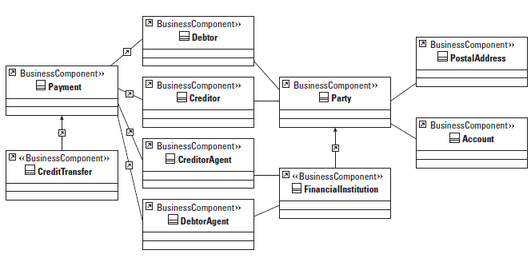
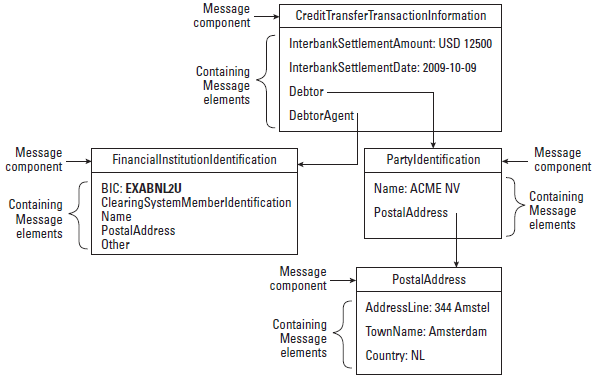
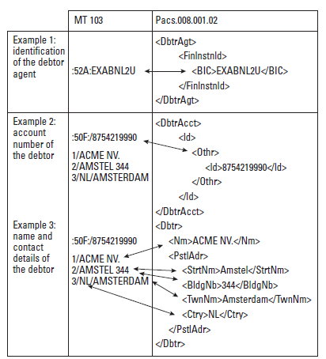

= ISO20022 vs SWIFT
:sectnums:
:toc:
:toclevels: 4
:toc-title: My Content

== ISO 20022 Message Structure
.Simplified Business Information model for payment

.Credit Transfer Message Structure

== ISO 20022 Message Types

[cols="4,6"]
|===
|Message |Description
|caaa
|Acceptor to Acquirer Card Transactions

|cain
|Acquirer to Issuer Card Transactions

|catm
|Card Terminal Management

|catp
|ATM Card Transactions

|caam
|ATM Management

|pacs
|Payments Clearing and Settlement

|pain
|Payments Initiation

|camt
|Cash Management

|remt
|Payments Remittance Advice

|fxtr
|Foreign Exchange Trade

|colr
|Collateral Management

|setr
|Securities Trade

|secl
|Securities Clearing

|sese
|Securities Settlement

|semt
|Securities Management

|seev
|Securities Events

|tsin
|Trade Services Initiation

|tsmt
|Trade Services Management

|reda
|Reference Data
|===

== ISO20022 and MT103 Mapping
.MT103 to ISO20022

== ISO20022 Messages vs Payments
[cols="1,2"]
|===
|Message Format |Usage

|pacs.008.001.02
|SEPA SCT

|pacs.003
|SEPA DD

|pacs.004.001.02
|Return of CT / Refund of DD

|camt.056.001.01
|Cancellation/Recall

|camt.029.001.03
|Response to recall

|pacs.002S2
|CVF status report

|pacs.002
|Reject to DD

|pacs.007
|Reversal of DD

|pain.001
|CT

|pain.008
|DD

|pain.009
|Mandate Initiation

|pain.010
|Mandate Amendment

|pain.011
|Mandate Cancellation

|pain.002
|Payment Advice

|===
