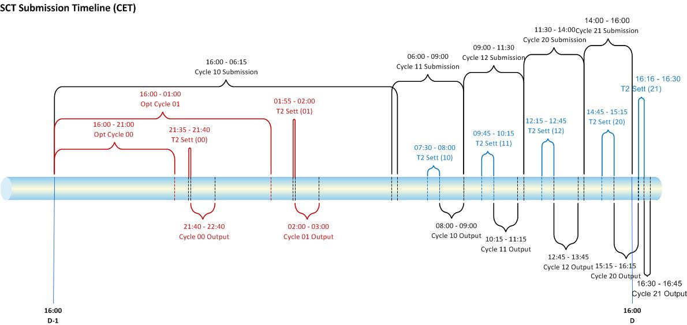
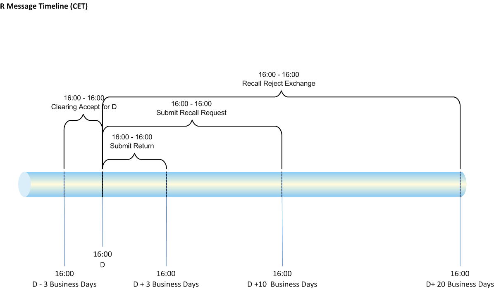
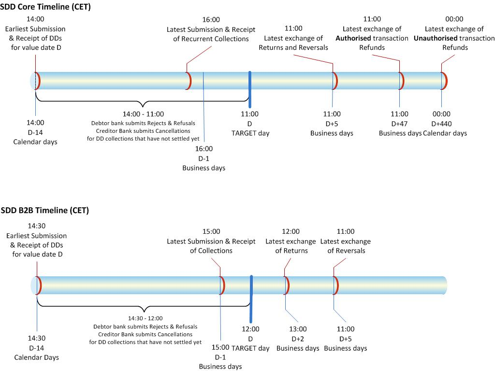

= SEPA
:sectnums:
:toc:
:toclevels: 4
:toc-title: Table of Contents

== SEPA SCT Timeline

.SCT Submission Timeline (CET)

.SCT RMessage Timeline (CET)

== SEPA SCT Message Catalog
[cols="1,1,5,1,2"]
|===
|From   |To   |Message Description   |File Type   |Format
|DPS   |CSM   |Credit Transfers as part of ICF - Input Credit File to EBA STEP2 throughout the day   |ICF   |pacs.008.001.02
|DPS   |CSM   |Return/Positive answer to a Recall as part of ICF - Input Credit File to EBA STEP2 throughout the day   |ICF   |pacs.004.001.02
|DPS   |CSM   |Payment Cancellation Requests (Recalls) as part of ICF - Input Credit File to EBA STEP2 throughout the day   |ICF   |camt.056.001.01
|DPS   |CSM   |Negative answer to a Recall as part of ICF - Input Credit File to EBA STEP2 throughout the day   |ICF   |camt.029.001.03
|CSM   |DPS   |Status report as part of CVF – Credit Validation File received as response to submitted ICF file   |CVF   |pacs.002S2
|CSM   |DPS   |PCF - The Payment Cancellation File is offered as an optional service for members of EBA to subscribe to in order to receive it . The file contains the status of Payment Cancellation Requests. It is sent at the end of each cycle to report on the status of transactions treated by the CSM   |PCF   |pacs.002S2
|CSM   |DPS   |Credit Transfers as part of SCF - Settled Credit File   |SCF   |pacs.008.001.02
|CSM   |DPS   |Return/Positive answer to a Recall as part of SCF - Settled Credit File   |SCF   |pacs.004.001.02
|CSM   |DPS   |Payment Recall as part of SCF - Settled Credit File   |SCF   |camt.056.001.01
|CSM   |DPS   |Negative answer to a Recall as part of SCF - Settled Credit File   |SCF   |camt.029.001.03
|CSM   |DPS   |Receipt of Change Account Identification (CAI) Messages   |SCF   |acmt.022.001.02
|CSM   |DPS   |Notifications of submitted credit transfers cancelled during settlement as part of CCF - Cancelled Credit File   |CCF   |camt.029.001.03
|CSM   |DPS   |RTF - Routing Table File, containing the Direct and Indirect Participant lists sent to all STEP2 Direct Participants   |RTF   |CSV file
|CSM   |DPS   |CRR - Cycle Reconciliation Report, includes data to allow reconciliation in terms of amounts debited and credited for the relevant settlement cycle   |CRR   |CSV file
|CSM   |DPS   |DRR -Daily Reconciliation Report, include data to allow reconciliation in terms of transactions sent and received, and in terms of amounts debited and credited for the relevant business date   |DRR   |CSV file
|CSM   |DPS   |MSR - Monthly Statistical Report, includes data to allow statistical reconciliation in terms of transactions sent and received, and in terms of amounts debited and credited.   |MSR   |CSV file
|CSM   |DPS   |PSR - Pre-Settlement Report, includes data for the relevant settlement cycle on Credit Transfers sent, Credit Transfers received, Returns sent and Returns received. The information shows total counts and amounts for the reported cycle.   |PSR   |CSV file
|===

== SEPA DD Timelines
.SDD Submission Timeline (CET)

.SDB Submission Timeline (CET)

== SEPA DD Message Catalog

[cols="1,1,5,1,2"]
|===
|From   |To   |Message Description   |File Type   |Format
|DPS |CSM | Submission of Direct Debit Collections   |IDF   |pacs.003
|DPS |CSM | Submission of Payment Cancellation Request for Submitted Direct Debits before their settlement   |IDF   |camt.056
|DPS |CSM | Submission of Payment Reversal for Submitted Direct Debits after their settlement   |IDF   |pacs.007
|DPS |CSM | Submission of Reject of Received Direct Debit Collection before its settlement   |IDF   |pacs.002
|DPS |CSM | Submission of Return or Refund request for Received Direct Debit Collection after its settlement   |IDF   |pacs.004
|CSM |DPS | IDF file acceptance   |DVF   |pacs.002S2
|CSM |DPS | Receipt of Direct Debit Collections   |DNF   |pacs.003
|CSM |DPS | Receipt of Payment Cancellation Requests of Received Direct Debits   |DNF   |camt.056
|CSM |DPS | Receipt of Rejects of Submitted Direct Debits   |DNF   |pacs.002
|CSM |DPS | Receipt of Change Account Identification (CAI) Messages   |DNF   |acmt.022
|CSM |DPS | Receipt of Returns/Refunds of Submitted Direct Debits   |DNF   |pacs.004
|CSM |DPS | Receipt of Reversals of Received Direct Debits   |DNF   |pacs.007
|CSM |DPS | Results of Settlement file   |RSF   |pacs.002S2
|CSM |DPS | Pre-settlement report   |PSR   |csv file
|CSM |DPS | Daily Reconciliation Report   |DRR   |csv file
|CSM |DPS | Monthly Statistical Report   |MSR   |csv file
|CSM |DPS | Routing Table Files for Direct and Indirect Participants   |RTF   |csv file