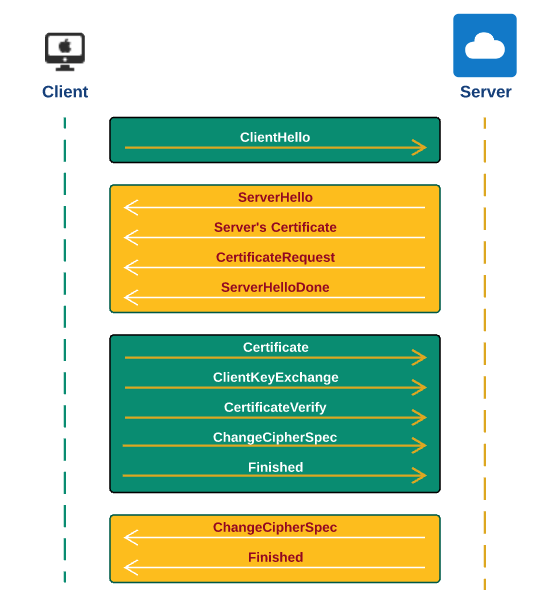

= Two SSL Certificate
:sectnums:
:toc:
:toclevels: 4
:toc-title: Table of Contents

Two-way SSL is also called mutual authentication. It's mostly used in server to server communications.

Usually, when access web sites like https://somecompany.com, it is one-way SSL. That means only the client verifies the certificates from the server. Servers don't verify the client's certificate. But for two-way certificate, server will also verify the client's certificate.

.https://dzone.com/articles/mutual-authentication-two-way-ssl-explained-using[Mutual Authencation]

To configure two-way SSL::
. Generate self-signed certificates using some tools.
. Create server keystore and trust store.
. Create a client keystore and truststore.
. Configure RESTful services with mutual authencation.

See https://docs.spring.io/spring-boot/docs/current/reference/htmlsingle/#howto-configure-ssl[Spring RESTful SSL Configuration]

Example for Configuring Weblogic::
. http://weblogic-tips.com/2010/05/20/two-way-ssl-on-weblogic-server/[Two Way SSL on Weblogic Server]

. Create a User and Authorization in Weblogic
....
Create a User and Authorization in Weblogic

1. In WebLogic Administration console for AdminServer, create a new user in Security Realms >myrealm >Users and Groups:

a. Username = Your computer name. This user must be a member of AppTester.
b. Create a group AppTester if it does not exist.
c. Create a role AppTester if it does not exist. The group AppTester must have this role. This role must be the same as defined in services/WEB-INF/web.xml.

2. In WebLogic Administration console for AdminServer, in Security Realm>myrealm>Providers, look for DefaultIdentityAsserter.  If it doesn't exist, create it.  Then:

a. Edit DefaultIdentityAsserter
b. Add X.509 to Chosen (make it the only one in the list)
c. Click the ProviderSpecific tab
d. Select CN in Default User Name Mapper Attribute Type. It is assumed that the user name is available in the subject name in the certificate.  (it is in ours - check by double-clicking the certificate in the Firefox configuration - you should see your machine name as CN)
e. Check "Use Default User Name Mapper"
f. Save the DefaultIdentityAsserter
g. Restart WebLogic

3. To test this configuration:

a. Access the "advanced" section of the SSL tab of the WebLogic AdminServer configuration, and set Two Way Client Cert Behavior to "Client Certs Requested and Enforced".
b. Check and make sure the file "\services\WEB-INF\web.xml " in the EAR file has similar contents as below:

<security-constraint>
    <web-resource-collection>
        <web-resource-name>services</web-resource-name>
        <url-pattern>/*</url-pattern>
        <http-method>GET</http-method>
        <http-method>POST</http-method>
    </web-resource-collection>
    <auth-constraint>
        <role-name>AppTester</role-name>
    </auth-constraint>
    <user-data-constraint>
        <transport-guarantee>CONFIDENTIAL</transport-guarantee>
    </user-data-constraint>
</security-constraint>

<login-config>
    <auth-method>CLIENT-CERT</auth-method>
</login-config>

c. After restarting the server with the new security-constraint, submit a web-service request with a utility user, and omit the password.  If 2-way SSL is configured correctly, the request will succeed.
....

. Changes in web.xml
....
<?xml version='1.0' encoding='UTF-8'?>
<web-app xmlns="http://java.sun.com/xml/ns/javaee" xmlns:xsi="http://www.w3.org/2001/XMLSchema-instance" version="2.5">
  <display-name>WebServicesWebApp</display-name>

  <!--
   The following is for Two-Way SSL Client Certificate. The Weblogic or other application
   server need to be configured properly. For example: 1) enabling SSL; 2) configuring
   server and client certificates which includes private and public keys, pass phrases,
   key stores, etc.

   1. The Package/pom.xml will uncomment the following security-constraint when creating release
      package to client.
   2. The services\pom.xml will filter the value of security.clientcert.role based on project.properties.

   For WebSphere, add the following as well:
        <security-role>
            <role-name>AppTester</role-name>
        </security-role>
    -->

  <!-- ${security-client-certificate-start}  // <1>
  <security-constraint>
      <web-resource-collection>
          <web-resource-name>services</web-resource-name>
          <url-pattern>/*</url-pattern>
          <http-method>GET</http-method>
          <http-method>POST</http-method>
      </web-resource-collection>
      <auth-constraint>
          <role-name>AppTester</role-name>
      </auth-constraint>
      <user-data-constraint>
          <transport-guarantee>CONFIDENTIAL</transport-guarantee>
      </user-data-constraint>
  </security-constraint>

  <login-config>
      <auth-method>CLIENT-CERT</auth-method>
  </login-config>
  ${security-client-certificate-end} -->
</web-app>
....
<1> Needed to custom WAR package for release to clients. Internally, we don't need to have two-way SSL.

. Set up SOAP UI
....
Setting up SOAP UI
Save a copy of the attached certificate file, ClientCert-pkcs-12-cert_WYANG to a folder, say, C:\Temp. This certificate was issued to "WYANG" which is to be authorized by Weblogic server. Changes in Weblogic are needed if you want to use different certificates.
Start your SOAP UI
Click File / Preference and then tab SSL Settings
Browse or enter the full path of the file, say, "C:\Temp\ClientCert-pkcs-12-cert_WYANG"
Enter keypass into the KeyStore Password box
Check Client Authentication as "required"
....
