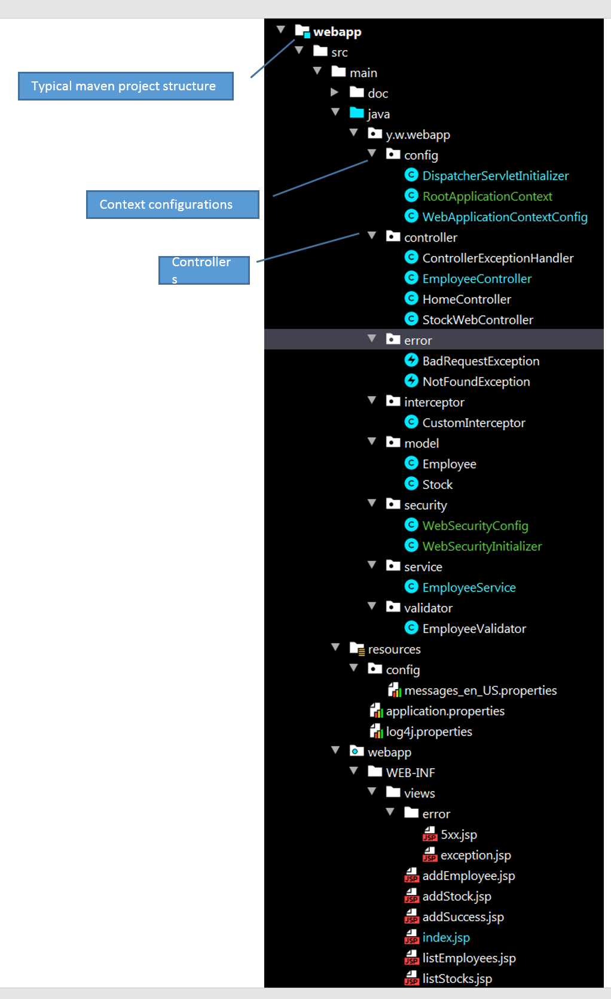
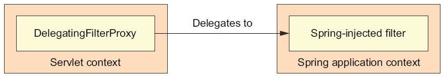

= Building a Web without Spring Boot
:sectnums:
:toc:
:toclevels: 4
:toc-title: Table of Contents

== Project Structure

This is typical Maven project structure. The Java source code files are grouped as below:

. Spring application context configurations in /config folder
. Controllers stay in /controller. These controllers are UI components which will be scanned by Web Application Context.
. Custom exceptions are in /error
. Interceptors are in /interceptor
. Models are in /model
. Security configurations are in /security
. Service components are in /service
. Validators are in /validator
. All the web resources including JSP files are in webapp. This is by default required by maven. If Spring Boot auto-configuration is used, the web resources will need to be in /resources/static, etc.

== Application Contexts

There will be two application contexts:

. Web Application Context -  this is the application context loaded by DispatcherServlet. This context manages all the components including controllers, validators, services, init bindings, etc. They are UI components.
. Root application context is the one loaded by ContextLoaderListener. It manages components including security configurations, domains, etc which are backend components.

=== Servlet Configurations

Spring provides DispatcherServlet as an implementation of Servlet API. Java configuration, instead of web.xml, is used to configure the Servlet.

Based on Servlet 3.0+ API, the container will look for a Java class which implements interface ServletContaierInitializer to initialize Servlet.

Servlet API has the following methods (not all listed here):

. init(ServletConfig config) - each Servlet has it's own instance of ServletConfig, which stores the parameters (name / value pairs) for a particular Servlet.
. service(ServletRequest req, ServletResponse res) - the main entry called by container to serve the client HTTP request.
. destroy() - destroy the Servlet.

There is [blue white-background]#ONE# [blue white-background]#ServletContext# for all the Servlet instances. It stores all the name/value pair parameters.

[source,java]
----
public class DispatcherServletInitializer extends AbstractAnnotationConfigDispatcherServletInitializer           // <1>
{
    @Override
    protected Class<?>[] getRootConfigClasses()                 // <2>
    {
        return new Class[]{RootApplicationContext.class};
    }

    @Override
    protected Class<?>[] getServletConfigClasses()              // <3>
    {
        return new Class[]{WebApplicationContextConfig.class};
    }

    @Override
    protected String[] getServletMappings()                     // <4>
    {
        return new String[]{"/"};
    }
}
----
<1> Implementation of interface [blue white-background]#WebApplicationInitializer#. When start up, [blue white-background]#SpringServletContainerInitializer# will find this [blue white-background]#DispatcherServletInitializer# and load the configurations for Servlet. In turn, [blue white-background]#SpringServletContainerInitializer# will be recognized by the container because it implements [blue white-background]#ServletContainerInitializer#.
<2> Loads the root application context.
<3> Loads the web application context.
<4> The path the Servlet maps.

[blue white-background]#AbstractAnnotationConfigDispatcherServletInitializer# will initialize both [blue white-background]#DispatcherServlet# and [blue white-background]#ContextLoaderListener#.

=== Root Application Context
Root application context is the parent context of Web Application Context, which manages beans shared by all the servlets. In other words, the beans in the root application context are used by the entire web application.

Web application context is the child context of the root application context. It has all the beans used by a particular DispatcherServlet.

If the application is simple and there are not so many beans, then one web application context might be enoguh. In this case, there is no need to create a root application context.

[source,java]
----
@Configuration
@ComponentScan(basePackages = {
        "y.w.webapp.model",                     // <1>
        "y.w.webapp.security",                  // <2>
        "y.w.webapp.service",                   // <3>
})
public class RootApplicationContext
{
}
----
<1> Scan the components for models.
<2> Scan the components for security configurations.
<3> Scan the components for services.

=== Web Application Context
[source,java]
----
@Configuration
@EnableWebMvc                                                     // <1>
@ComponentScan(basePackages = {                                   // <2>
        "y.w.webapp.controller",
        "y.w.webapp.validator",
})
public class WebApplicationContextConfig implements WebMvcConfigurer  // <3>
{
    @Bean
    public ViewResolver viewResolver()                           // <4>
    {
        InternalResourceViewResolver resolver = new InternalResourceViewResolver();
        resolver.setPrefix("/WEB-INF/views/");
        resolver.setSuffix(".jsp");
        resolver.setViewClass(JstlView.class);
        resolver.setOrder(1);
        resolver.setExposeContextBeansAsAttributes(true);

        return resolver;
    }

    @Override
    public void configureDefaultServletHandling(DefaultServletHandlerConfigurer configurer)                 // <5>
    {
        configurer.enable();
    }

    @Bean(name = "messageSource")                             // <6>
    public MessageSource getMessageSource() {
        ReloadableResourceBundleMessageSource messageSource = new ReloadableResourceBundleMessageSource();
        messageSource.setBasename("classpath:config/messages_en_US");
        messageSource.setCacheSeconds(1);
        messageSource.setUseCodeAsDefaultMessage(true);
        messageSource.setDefaultEncoding("UTF-8");

        return messageSource;
    }

    @Bean CustomInterceptor customInterceptor() {
        return new CustomInterceptor();
    }

    @Override
    public void addInterceptors(InterceptorRegistry registry) {  // <7>
        registry.addInterceptor(customInterceptor());
    }
}
----
<1> Enable Spring Web MVC. This will configure the following components.
* DefaultAnnotationHandlerMapping
* AnnotationMethodHandlerAdapter
* ExceptionHandlerExceptionResolver. Additionally,
* @NumberFormat, @DateTimeFormat
* @Valid annotation to validate the
* Controller method's parameters, @RequestBody and @ResponseBody annotation in the @RequestMapping
* @ExceptionHandler
<2> Scans the UI components.
<3> The Web application context needs to implement [blue white-background]#WebMvcConfigurer#.
<4> Configure JSP view resolver.
<5> Enables default Servlet handler mapping.
<6> International messages.
<7> Add interceptor.

=== Equivalence of Web.xml
[source,xml]
----
<web-app xmlns="http://java.sun.com/xml/ns/javaee"
        xmlns:xsi="http://www.w3.org/2001/XMLSchema-instance"
        xsi:schemaLocation="http://java.sun.com/xml/ns/javaee
        http://java.sun.com/xml/ns/javaee/web-app_3_0.xsd"
        version="3.0">
  <display-name>Demo for understanding web.xml of spring mvc project</display-name>

  <!-- ===================================================== -->
  <!--  1. Create root context with spring listener          -->
  <!--     Remove this means only use servlet contxt         -->
  <!-- ===================================================== -->
  <listener>
    <listener-class>org.springframework.web.context.ContextLoaderListener</listener-class>
  </listener>

  <!-- ===================================================== -->
  <!-- The Root Application Context                          -->
  <!-- ===================================================== -->
  <context-param>
    <param-name>contextConfigLocation</param-name>
    <param-value>classpath:root-context.xml</param-value>
  </context-param>

  <!-- ===================================================== -->
  <!--  2. Define servlet with private context:              -->
  <!--     Web Application Context                           -->
  <!-- ===================================================== -->
  <servlet>
    <servlet-name>dispatcher</servlet-name>
    <servlet-class>org.springframework.web.servlet.DispatcherServlet</servlet-class>
    <!-- ================================================= -->
    <!-- Where to load Web Application Context             -->
    <!-- ================================================= -->
    <init-param>
      <param-name>contextConfigLocation</param-name>
      <param-value>classpath:webApplicationContext.xml</param-value>
    </init-param>
    <load-on-startup>1</load-on-startup>
  </servlet>
  <!-- ===================================================== -->
  <!-- One servlet, the dispatcher, URL mapping              -->
  <!-- ===================================================== -->
  <servlet-mapping>
    <servlet-name>dispatcher</servlet-name>
    <url-pattern>/</url-pattern>
  </servlet-mapping>
</web-app>
----

ContextLoaderListener does the following:
. tie the lifecycle of the application context to the lifecycle of ServletContext.
. automate the creation of the application context so you don't have to write explicit code to create it. It's a convenience function.

ServletContextListener creates WebApplicationContext, which provides access to the ServletContext if it is ServletContextAware.

== Exception Handlers
=== Exception Handlers as Controller Advice
[blue white-background]#@ControllerAdvice# is used to provide handlers for exceptions.

[source,java]
----
@ControllerAdvice
public class ControllerExceptionHandler
{
    @ExceptionHandler
    public ModelAndView handleDefault(BadRequestException e)
    {
        log.info("From @ControllerAdvice");
        ModelAndView model = new ModelAndView("error/exception"); // View name
            model.addObject("exception", e);
            return model;
    }
}
----

Controller Advice will be applied to all the controllers. Otherwise, the annotation can add parameters to specify the target controllers.

[source,java]
----
@ControllerAdvice(assignableTypes = { MeasurementsResourceController.class, StatsResourceController.class })
public class ControllerAdviceInitBinder
{
}
----

=== Exception Handler Using @ExceptionHandler
[source,java]
----
@Controller
@RequestMapping("/stocks")
public class StockWebController
{
    // ...
    @ExceptionHandler
    public ModelAndView handleDefault(NotFoundException e)
    {
        log.info("From @ExceptionHandler in " + this.getClass().getName());

        ModelAndView model = new ModelAndView("error/exception"); // View name
        model.addObject("exception", e);
        return model;
    }
    // ...
}
----

== Interceptors
Interceptors can do some processing before and/or after the request is processed.

[source,java]
----
public class CustomInterceptor implements HandlerInterceptor
{
    @Override public boolean preHandle(HttpServletRequest request, HttpServletResponse response, Object handler) throws Exception
    {
        String queryString = request.getQueryString() == null ? "" : "?" + request.getQueryString();
        String path = request.getRequestURL() + queryString;

        long startTime = System.currentTimeMillis();
        request.setAttribute("startTime", startTime);

        log.info("Inside pre handle: " + path);
        return true;
    }

    @Override public void postHandle(HttpServletRequest request, HttpServletResponse response, Object handler,
            ModelAndView modelAndView) throws Exception
    {
        String queryString = request.getQueryString() == null ? "" : "?" + request.getQueryString();
        String path = request.getRequestURL() + queryString;

        long startTime = (Long) request.getAttribute("startTime");
        long endTime = System.currentTimeMillis();
        log.info(String.format("%s millisecond taken to process the request %s.",(endTime - startTime), path));
    }

    @Override public void afterCompletion(HttpServletRequest request, HttpServletResponse response, Object handler, Exception exception) throws Exception
    {
        String queryString = request.getQueryString() == null ? "" : "?" + request.getQueryString();
        String path = request.getRequestURL() + queryString;

        log.info("Inside after completion " + path);
    }
}
----

== Security
There are two major steps.

=== Configure DelegatingFilterProxy
Spring Security employs several servlet filters to provide various aspects of security. DelegatingFilterProxy is a special servlet filter that, by itself, doesn’t do much.
Instead, it delegates to an implementation of javax.servlet.Filter that’s registered
as a <bean> in the Spring application context

The first thing to do is to configure a Servlet filter. It is as simple as a class implementing [blue white-background]#AbstractSecurityWebApplicationInitializer#

[source,java]
----
public class WebSecurityInitializer extends AbstractSecurityWebApplicationInitializer
{
}
----

=== Configure the Security

[source,java]
----
@Configuration                                                       // <1>
@EnableWebSecurity                                                   // <2>
public class WebSecurityConfig extends WebSecurityConfigurerAdapter  // <3>
{
    @Override
    protected void configure(HttpSecurity http) throws Exception     // <4>
    {
        http
           .authorizeRequests()
           .antMatchers("/employees").hasAuthority("USER")
           .and().formLogin()
           .and()
           .httpBasic();
    }

    @Override
    protected void configure(AuthenticationManagerBuilder auth) throws Exception        // <5>
    {
        auth.inMemoryAuthentication()
            .withUser("wyang").password(passwordEncoder().encode("wyang")).authorities("USER")
            .and()
            .withUser("admin").password(passwordEncoder().encode("admin")).authorities("USER");
    }

    @Bean
    public PasswordEncoder passwordEncoder() {                    // <6>
        return new BCryptPasswordEncoder();
    }
}
----
<1> Security configuration is Spring component. This component is not UI. So it is part of root application context.
<2> Enable Web Security
<3> Implements [blue white-background]#WebSecurityConfigurerAdapter#
<4> Configure the URLs to be secured and the roles or authority being granted with access.
<5> Configure users and roles.
<6> Use an encoder. The password stored by spring will be in the format of "{id}<encoded password>", where "id" is the id representing the encoder.

Alternatively, for test and development purpose, we can use the following:

[source,java]
----
@Configuration
@EnableWebSecurity
public class WebSecurityConfiguration extends WebSecurityConfigurerAdapter
{
    // ignoring the other parts...

    @Override
    protected void configure(AuthenticationManagerBuilder auth) throws Exception
    {
        auth.inMemoryAuthentication()
            .withUser("wyang").password("{noop}wyang").authorities("USER")
            .and()
            .withUser("admin").password("{noop}admin").authorities("USER");
    }
}
----

== Validations

=== Custom Validation
[source,java]
----
@Component
public class EmployeeValidator implements Validator
{

    public boolean supports(Class clazz) {
        return Employee.class.isAssignableFrom(clazz);
    }

    public void validate(Object target, Errors errors)
    {
        ValidationUtils.rejectIfEmptyOrWhitespace(errors, "firstName", "error.firstName", "First name is required.");
        ValidationUtils.rejectIfEmptyOrWhitespace(errors, "lastName", "error.lastName", "Last name is required.");
        ValidationUtils.rejectIfEmptyOrWhitespace(errors, "email", "error.email", "Email is required.");
    }

}
----

Usage:

[source,java]
----
@Controller
@RequestMapping("/employees")
@SessionAttributes("employee")
public class EmployeeController
{
    private final EmployeeValidator validator;           // <1>
    // ...
    @RequestMapping(value = "/addNew", method = RequestMethod.POST)
    public String submitForm(@ModelAttribute("employee") Employee employeeVO, BindingResult result, SessionStatus status) {

        validator.validate(employeeVO, result);         // <2>

        if (result.hasErrors()) {
            return "addEmployee";
        }

        employeeService.addEmployee(
                new Employee(employeeVO.getId(),
                             employeeVO.getFirstName(),
                             employeeVO.getLastName(),
                             employeeVO.getEmail()));

        // Mark Session Complete
        status.setComplete();
        return "redirect:success";
    }

    //...
}
----
<1> The validator will be injected by the constructor.
<2> Calls the validator to validate it.

See the related JSP to see how errors will displayed.

=== JSR 303 Validation
Validation definitions are added to models directly by annotations.

[source,java]
----
public class Stock
{
    @NotBlank(message = "Stock name is required")
    private String stockName;

    @Positive(message = "Shares must be positive number")
    private int    shares;

    @NotNull(message = "Purchase date cannot be empty")
    @Past(message = "Purchase date must be past")
    @DateTimeFormat(pattern = "mm/dd/yyyy") // Date data binding
    private Date   date;
}
----

There is no need to define a validator class.

Usage:
[source,java]
----
@Controller
@RequestMapping("/stocks")
public class StockWebController
{
    private Validator validator;                     // <1>

    public StockWebController()                      // <2>
    {
        ValidatorFactory validatorFactory = Validation.buildDefaultValidatorFactory();
        validator = validatorFactory.getValidator();
    }

    @PostMapping("/addstock")
    public ModelAndView submit(@Valid @ModelAttribute("stock") Stock stock, BindingResult result, SessionStatus status)
    {
        Set<ConstraintViolation<Stock>> violations = validator.validate(stock); // <3>

        for (ConstraintViolation<Stock> violation : violations)
        {
            String propertyPath = violation.getPropertyPath().toString();
            String message = violation.getMessage();
            // Add JSR-303 errors to BindingResult
            // This allows Spring to display them in view via a FieldError
            result.addError(new FieldError("stock", propertyPath,
                    "Invalid "+ propertyPath + "(" + message + ")"));
        }

        if (result.hasErrors())
        {
            return new ModelAndView("addStock");
        }

        // ...
    }
}
----
<1> Use javax.validation.
<2> Use Hibernet implementation of javax.validation.
<3> Use the validator.

== @InitBinder and WebDataBinder

Sometimes, it may have problem converting data from HTML form to a Java class instance. For example, the date field of Stock cannot be converted without instructing Spring how to convert. Otherwise, Spring will throw parsing exception.

=== Defining @InitBinder within Controller

[source,java]
----
@Controller
@RequestMapping("/stocks")
public class StockWebController
{
    // ...
    @InitBinder
    protected void initBinder(WebDataBinder binder) {
        binder.addCustomFormatter(new DateFormatter("yyyy-MM-dd"));
    }
}
----

==== Defining @InitBinder with ControllerAdvice
[source,java]
----
@ControllerAdvice(assignableTypes = { MeasurementsResourceController.class, StatsResourceController.class })
public class ControllerAdviceInitBinder
{
    private static class Editor<T> extends PropertyEditorSupport
    {
        private final Function<String, T> parser;
        private final Format              format;

        public Editor(Function<String, T> parser, Format format) {

            this.parser = parser;
            this.format = format;
        }

        public void setAsText(String text) {

            setValue(this.parser.apply(text));
        }

        @SuppressWarnings("unchecked")
        public String getAsText() {

            return format.format((T) getValue());
        }
    }

    @InitBinder
    public void initBinder(WebDataBinder webDataBinder) {

        webDataBinder.registerCustomEditor(
                Instant.class,
                new Editor<>(
                        Instant::parse,
                        DateTimeFormatter.ISO_INSTANT.toFormat()));

        webDataBinder.registerCustomEditor(
                LocalDateTime.class,
                new Editor<>(
                        text -> LocalDateTime.parse(text, DateTimeFormatter.ofPattern("dd/MM/yyyy HH:mm:ss")),
                        DateTimeFormatter.ofPattern("dd/MM/yyyy HH:mm:ss").toFormat()));

        webDataBinder.registerCustomEditor(
                ZonedDateTime.class,
                new Editor<>(
                        text -> ZonedDateTime.parse(text, DateTimeFormatter.ISO_ZONED_DATE_TIME).withZoneSameInstant(ZoneId.of("UTC")),
                                DateTimeFormatter.ISO_ZONED_DATE_TIME.toFormat()));

        webDataBinder.registerCustomEditor(
                Statistic.class,
                new StatisticsConverter());
    }

    public static class StatisticsConverter extends PropertyEditorSupport
    {
        @Override
        public void setAsText(String text) throws IllegalArgumentException
        {
            switch (text.toUpperCase())
            {
            case "MIN":
                setValue(Statistic.MIN);
                break;
            case "MAX":
                setValue(Statistic.MAX);
                break;
            case "AVERAGE":
                setValue(Statistic.AVERAGE);
                break;
            }
        }
    }
}
----
