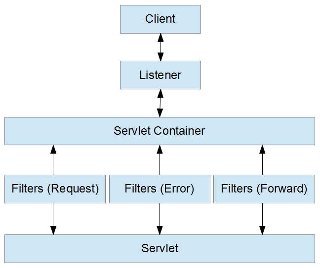

= Servlet API
:sectnums:
:toc:
:toclevels: 4
:toc-title: Table of Contents

== Filter

A filter is an object that dynamically intercepts requests and responses to transform or use the information contained in the requests or responses.

Filters typically do not themselves create responses but instead provide universal functions that can be "attached" to any type of servlet or JSP page.

The filter is run before rendering view but after controller rendered response.

A Filter is used in the web layer only as it is defined in web.xml.

Filters are more suitable when treating your request/response as a black box system. They'll work regardless of how the servlet is implemented.

Filters are used to perform filtering tasks such as login authentication ,auditing of incoming requests from web pages, conversion, logging, compression, encryption and decryption, input validation etc.

A Servlet Filter is used in the web layer only, you can't use it outside of a web context.

== Listener
Servlet Listener is used for listening to events in a web container, such as when you create a session or place an attribute in a session or if you passivate and activate in another container, to subscribe to these events you can configure listener in web.xml, for example, HttpSessionListener.

Listeners get triggered for an actual physical request that can be attached to events in your app server .With listeners, you can track application-level, session-level, life-cycle changes, attribute changes etc.

You can monitor and react to events in a servlet's life cycle by defining listener objects whose methods get invoked when lifecycle events occur.

== Interactions

== Sample Web.xml
[source,xml]
----
<web-app xmlns="http://java.sun.com/xml/ns/javaee"
        xmlns:xsi="http://www.w3.org/2001/XMLSchema-instance"
        xsi:schemaLocation="http://java.sun.com/xml/ns/javaee
        http://java.sun.com/xml/ns/javaee/web-app_3_0.xsd"
        version="3.0">
  <display-name>Demo for understanding web.xml of spring mvc project</display-name>

  <!-- ===================================================== -->
  <!--  1. Create root context with spring listener          -->
  <!--     Remove this means only use servlet contxt         -->
  <!-- ===================================================== -->
  <listener>
    <listener-class>org.springframework.web.context.ContextLoaderListener</listener-class>
  </listener>

  <!-- ===================================================== -->
  <!-- The Root Application Context                          -->
  <!-- ===================================================== -->
  <context-param>
    <param-name>contextConfigLocation</param-name>
    <param-value>/WEB-INF/root-context.xml</param-value>
  </context-param>

  <!-- ===================================================== -->
  <!--  2. Define servlet with private context:              -->
  <!--     Web Application Context                           -->
  <!-- ===================================================== -->
  <servlet>
    <servlet-name>dispatcher</servlet-name>
    <servlet-class>org.springframework.web.servlet.DispatcherServlet</servlet-class>
    <!-- ================================================= -->
    <!-- Where to load Web Application Context             -->
    <!-- ================================================= -->
    <init-param>
      <param-name>contextConfigLocation</param-name>
      <param-value>/WEB-INF/webApplicationContext.xml</param-value>
    </init-param>
    <load-on-startup>1</load-on-startup>
  </servlet>
  <!-- ===================================================== -->
  <!-- One servlet, the dispatcher, URL mapping              -->
  <!-- ===================================================== -->
  <servlet-mapping>
    <servlet-name>dispatcher</servlet-name>
    <url-pattern>/</url-pattern>
  </servlet-mapping>
</web-app>
----
